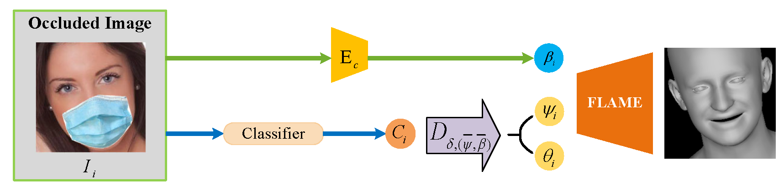

## Emotion region occluded 3D face reconstruction

by Zhan Li, Chuan Peng, Yuning Wang, Han Zhang, Qinru Sun, Runtian Chen


* We provide related codes and configuration files to reproduce the "Emotion region occluded 3D face reconstruction"

## Introduction
In this paper, we propose a new 3D face reconstruction problem with facial expression region occlusion. To address this issue, we constructed a specific dataset EmooFace and proposed a network DictNet. Compared with other methods, DictNet can fully utilize the facial expression parameters of the FLAME  model and construct an expression dictionary to achieve emotion region occluded 3D face reconstruction.

<div align="center">
  
</div>

<div align="center">
  
</div>

## Citation
```
@article{
}
```

## Train
If you are prompted for no packages, enter pip install * * to install dependent packages
```
python main_train.py --cfg CONFIG_PATH
```
for example, you can run
```
python main_train.py --cfg configs/release_version/deca_pretrain.yml
```

## Test
```
python demo_reconstruction.py -i INPUT_PATH -s SAVE_PATH
```
