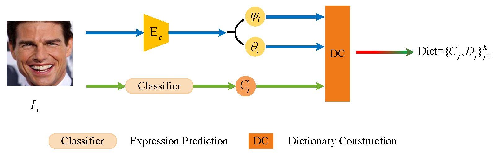

## Emotion region occluded 3D face reconstruction

by Zhan Li, Chuan Peng, Yuning Wang, Han Zhang, Qinru Sun, Runtian Chen


* We provide related codes and configuration files to reproduce the "Emotion region occluded 3D face reconstruction"

## Introduction
In this paper, an innovative 3D face reconstruction approach is put forward to reconstruct a single image in which the emotional region is occluded, with the aim of restoring the expression information within the occluded region and attaining the natural consistency of the entire face expression. Based on the FLAME model, this approach constructs an expression dictionary by using unshielded face images bearing expression labels, predicts the expression of input images via the expression recognition network, and retrieves the corresponding FLAME expression parameters to optimize the reconstruction process.

<div align="center">
  
</div>


## Citation
```
@article{
}
```

## Train
If you are prompted for no packages, enter pip install * * to install dependent packages
```
python main_train.py --cfg CONFIG_PATH
```
for example, you can run
```
python main_train.py --cfg configs/release_version/deca_pretrain.yml
```

## Test
```
python demo_reconstruction.py -i INPUT_PATH -s SAVE_PATH
```
